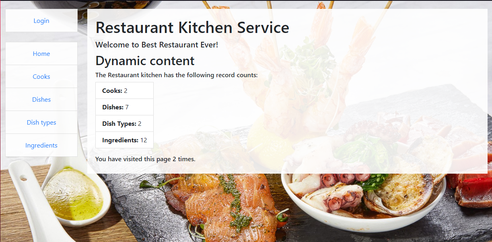
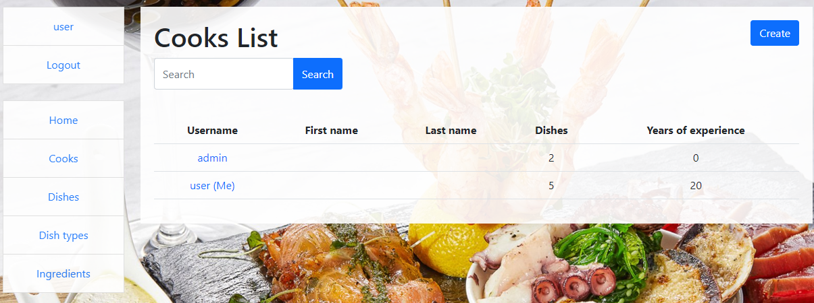
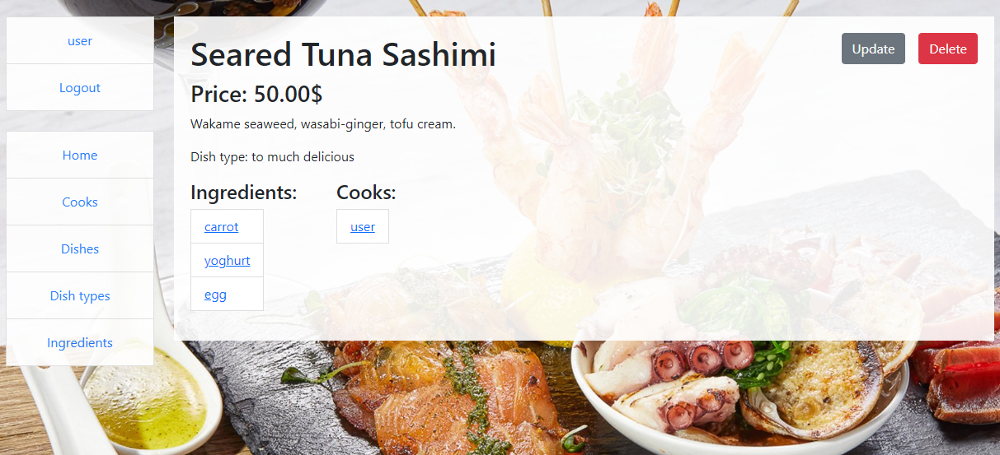
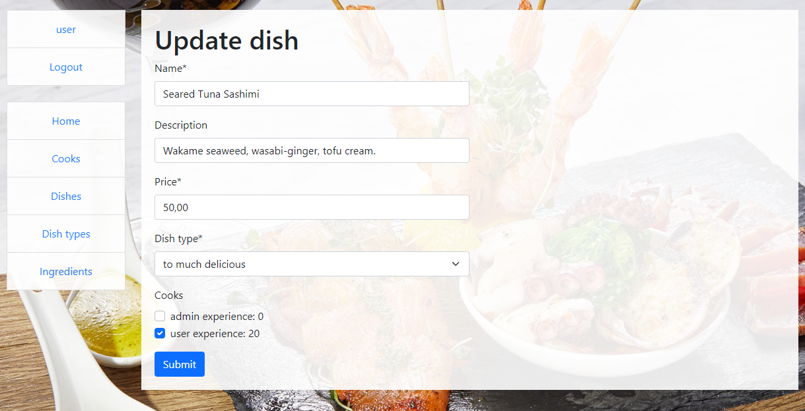

# restaurant-kitchen-service

Django project for managing cooks and dishes in kitchen

## Check it out!
[Restaurant kitchen service](https://restaurant-kitchen-service.onrender.com)


Login: user /
Password: user12345

## Installation

Python must be already installed

```shell
git clone https://github.com/Gr1zzZzzly/restaurant-kitchen-service.git
cd kitchen_progect
py -m venv venv
source venv/Scripts/activate
pip install -r requirements.txt
py manage.py runserver
```
## Features

* Authentication functionality for Cook/User
* Managing dishes and cooks directly from website
* Powerful admin panel for advanced managing





